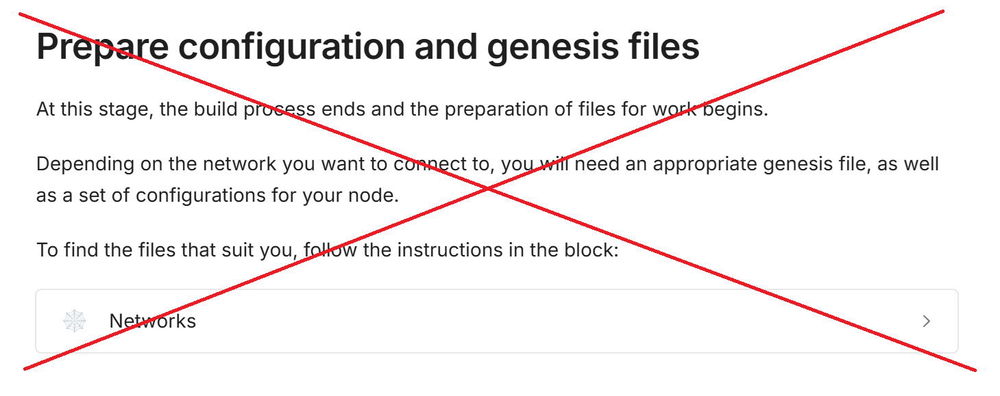

# Intro

This collection of files & scripts should be used to help with local testnet management. Before run - you should build the Klyntar core.

See https://docs.klyntar.org/build-core-and-join-network/run-kly-node

# After build, omit the last part about preparing configs and genesis:



# Preparing netrunner configs

See `netrunner_configs.json`

```json
{
    "corePath":"/full/path/to/KlyntarCore/klyn74r.js",
    "mode":"testnet",
    "testnetDir":"TESTNET_V5"
}
```

Depending on network size - switch `testnetDir` to 3 possible options:

1. `TESTNET_V2`
2. `TESTNET_V5`
3. `TESTNET_V21`

<br/><br/>

# Launching testnet with a single shard and 2 validators

1. Your `netrunner_configs.json` should look like this:

```json
{
    "corePath":"/full/path/to/KlyntarCore/klyn74r.js",
    "mode":"testnet",
    "testnetDir":"TESTNET_V2"
}
```

2. Then call

```shell
node setup.js
```
This should prepare directories for nodes of your testnet

3. Now update the timestamp

Change the timestamp for the first epoch for each node in your network

```shell
node update_timestamp_in_genesis.js
```

4. Finally - run your network

Just from a single shell

```shell
node runner.js 
```

<br/><br/>

# Launching testnet with a 3 shards and 5 validators

Your `netrunner_configs.json` should look like this:

```json
{
    "corePath":"/full/path/to/KlyntarCore/klyn74r.js",
    "mode":"testnet",
    "testnetDir":"TESTNET_V5"
}
```

Then repeat:

```shell
node setup.js

node update_timestamp_in_genesis.js

node runner.js
```

<br/><br/>

# Launching testnet with a single shard and 21 validators (almost prod)

Your `netrunner_configs.json` should look like this:

```json
Coming soon
```